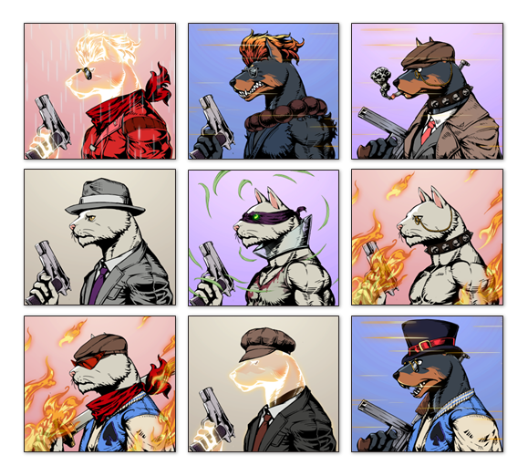

 

# 📚 Tech Stack 📚
        
      

---
# What is YieldKingZ

- **YieldKingZ** is a social casino project based on WEB 3.0 that allows users to receive cryptocurrency as a reward. 
+ **YieldKingZ** users utilize NFTs to compete with other holders in social casino games on the platform to earn points and claim tokens with earned points.
- **YieldKingZ** WEB 3.0-based **“Club”** system provides users to own and operate their own casino(s) by just simply staking NFTs.  And “Club” system operates and earning profits, without any intervention of platform service provider(YieldKingZ foundation).
+ **YieldKingZ** main goal is to increase the value of the token by suppressing the token inflation.
- The core problem with recent P2E projects is number of users decreases as their profit(Yield) decrease.  Eventually, this will affect tokenomics of each project and drop token prices and etc.
+ **YieldKingZ**, Web 3.0 Social Casino, provides casino games, which have very simple rules for quick adoption of the games but most importantly addictive, as a vehicle for users to farm.  Because the simple rules and addiction of the game will result in lower entrance barrier to our platform and user acquisition.
- Casino games retain users with tension and excitement caused by random results of each rounds.  With these unique characteristics of casino games are key factors to retain users in the system, even after long repeated playing games.  
Higher retention and easier acquisition of the users will naturally control supply and demand of the token, and results in higher income (High Yields) for the users.

---
# NFT

---
# Token Flow

---
## 🕹️ [Demo Play](https://test.yieldkingz.io)

